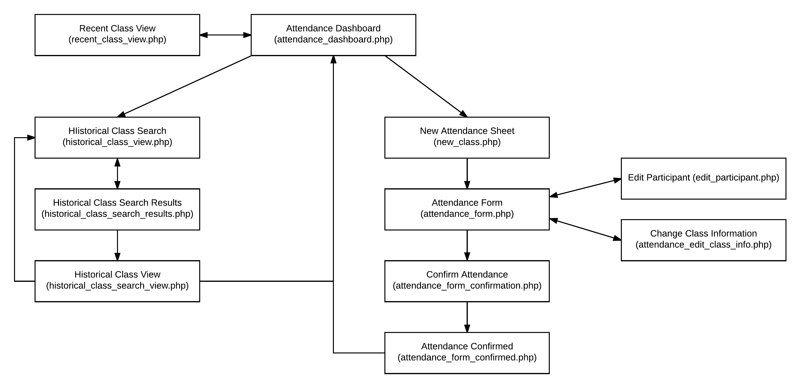

 # Attendance Documentation

 ## Overview

 ### Purpose of Document
To illustrate how the attendance application works in order to enable future
maintainers of the application.

 ### Overview of application
The attendance application is meant to be used by interns and facilitators
who require attendance to be recorded.

 ### Main Application Features

- Record attendance
- Overview of most recent classes
- Search for historical attendance by date, curriculum, and/or class
- View class attendance records
- Search for people to add to attendance by name
- Create and add new people to system when taking attendance
- Confirm attendance before submission
 
 ### List of Pages / PHP Files
1.  attendance_dashboard.php
2.  attendance_edit_class_info.php
3.  attendance_form.php
4.  attendance_form_confirmation.php
5.  attendance_form_confirmed.php
6.  attendance_utilities.php
7.  edit_participant.php
8.  historical_class_search.php
9.  historical_class_search_results.php
10. historical_class_search_view.php
11. historical_class_view.php
12. new_class.php
13. shared_queries.php

### List of JavaScript Files
1. attendance-scripts/attendance-form-add-new-person.js
2. attendance-scripts/attendance-utilities.js
3. attendance-scripts/dashboard-pagination.js

 ### Page Flow Diagram
 
 
 
 ### Attendance Team
 
- Brittany Ross (Information Technology)
- Colby Gray (Information Systems)
- Sami Ellougani (Computer Science - Desktop Application)
- Carlie Maxwell (Computer Science - Desktop Application)
- Scott Hansen (Computer Science - Web Application)

 ### Links
 [CPCA Web Application](https://github.com/Capping-CPCA/Web-App)
 
 [CPCA Database](https://github.com/Capping-CPCA/Database)
 
 [CPCA Desktop Attendance Application](https://github.com/Capping-CPCA/Attendance-App)